# Mobile local notifications WIP 

## Overview

Local notifications can be used to encourage players to return to a game. 

Unlike Remote notifications that are scheduled and deliverd from a server and typically have a slower cadence, local notifications are scheduled on the client and can therefore be used for scenarios with more immediate requirements.

This tutorial demonstrates how to use deltaDNA player segments and Event Triggered Campaigns to remotely control the precise targeting and timing of local notifications. You can trigger notifications to be delivered within a few minutes of the player triggering an action in the game. This tutorial applies to **iOS** and **Android** devices.

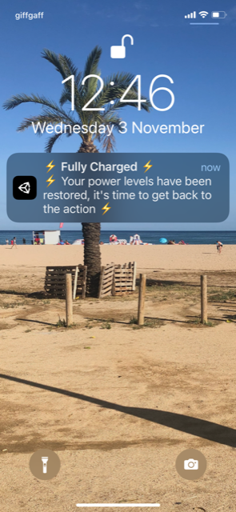

## Packages used

- Unity Mobile Notifications 1.4.2
https://docs.unity3d.com/Packages/com.unity.mobile.notifications@1.4/manual/index.html
- Unity DeltaDNA SDK
https://github.com/deltaDNA/unity-sdk/releases

You will learn how to:

- Go beyond slower cadence of remote push notifications using the power of local notifications.
- Trigger notifications as little as few minutes after an action based on event triggered campaigns

> Please note, this tutorial covers two very specific scenarios. 
>
> Please refer to the documentation and samples for [deltaDNA](https://docs.deltadna.com) and the [Unity Local Notifications](https://docs.unity3d.com/Packages/com.unity.mobile.notifications@1.4/manual/index.html) package for further information.

## Scenarios

This tutorial demonstrates:

1. Basics of local notifications
2. A local notification triggered by the player completing the first mission in the game.
3. A local notification triggered 1 minute after the player backgrounds or exits the game.

## Lifecycle

There are 3 distinct phases for each local notification:

1. **Setup** : The game producer creates the local notification and its targeting criteria on the deltaDNA platform
2. **Gameplay** : The player launches the game, plays and triggers the event criteria that result in the notification being scheduled locally
3. **Notify** : The local notification is delivered at the scheduled time and the player launches the game from it

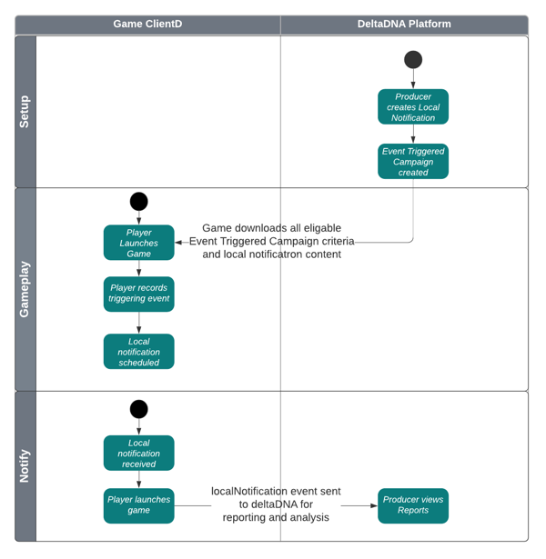

## Event Managment

The scenarios in this tutorial use events generated during gameplay to schedule new local notifications. 

The standard **missionCompleted** event will be used in the first scenario to schedule a local notification when the player completes missionID equal to 1

Two custom events, **gamePaused** & **gameResumed** have been added to the game, they will be used in the second scenario to schedule a notification when the player quits or backgrounds the game.
```csharp
    void OnApplicationPause(bool pauseStatus)
    {
        // Record a gamePaused or gameResumed event based on the pauseStatus       
        string eventName = pauseStatus == true ? "gamePaused" : "gameResumed";

        // Take Note - The DDNA SDK is started on Awake(), not on Start()
        // as OnApplicationPause() occurs before Start()       
        DDNA.Instance.RecordEvent(eventName).Run();        
    }
```

A new custom event called **localNotification** is used to generate reporting on the scheduling of local notifications by individual players.

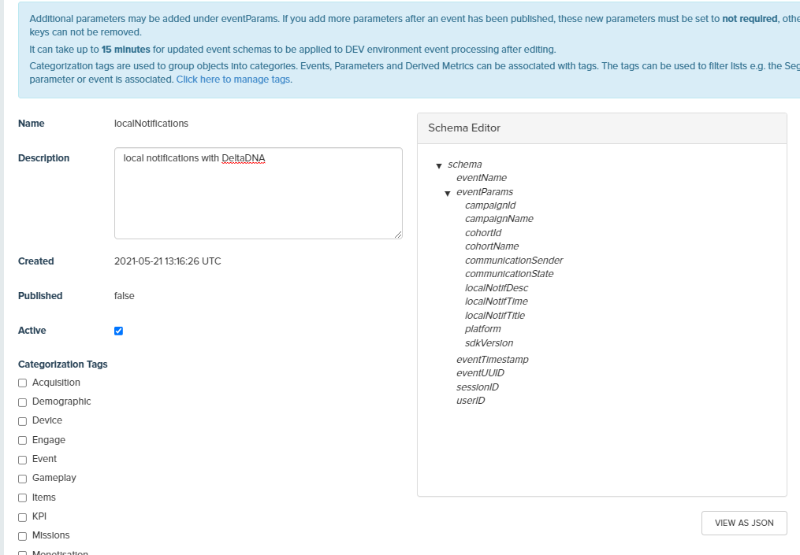

It contains the following game parameters to provide reporting on which local notifications each player is viewing.

- **localNotifTitle** - The title used for the local notification
- **localNotifDesc** - Description used for the local notification
- **localNotifTime** - The time offset from triggering the notification to delivery

There are also parameters to identify which campaign the local notification belongs to and any player cohort information if the campaign was an AB Test.

## Local Notification Content

An Engage In-Game "Game Parameter" action needs to be created for each local notification. It contains game parameters with values that will be used to instruct the game client on the notification content and scheduling time offset from the point that it is triggered. time is in minutes in this example

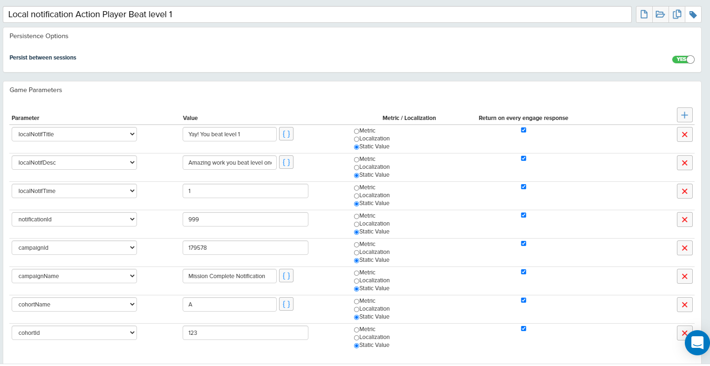

- **localNotifTitle** - The title used for the local notification
- **localNotifDesc** - Description used for the local notification
- **localNotifTime** - The time offset from triggering the notification to delivery
- **notificationId** - A unique ID that will be used to identify the notification

There are also parameters to identify which campaign the local notification belongs to and any player cohort information if the campaign was an AB Test, these parameters are simply passed back through to the **localNotification** reporting event.

## Event Triggered Campaigns

As their name suggests, Event Triggered Campaigns use the events that your player is generating whilst playing to trigger a campaign that performs an action in the game client immediately.

A payload containing all criteria and content for all Event Triggered Campaigns that the player may be elligible for is downloaded by the SDK at the start of each session. It can be reloaded periodiaclly during these session by calling the ```DDNA.Instance.RequestSessionConfiguration()``` SDK method.

The Game Parameter Actions you create are used to instruct the game code to perform some action. The Game Parameters within the action contain the details used to instruct the game to show an local notification. Your game will need to contain some code to recognize and act correctly when it receives these parameters.

The Event Triggered Campaign setup flow uses a wizard to guide you through the configuration steps

### Campaign setup for Scenario #1 - Mission 1 completed

A local notification will be scheduled for delivery 1 minute after the player records a **missionCompleted** event with the missionID equal to 1

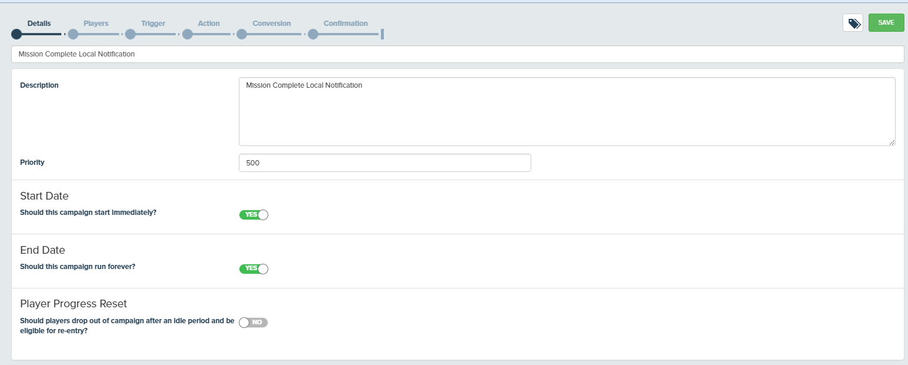

Target Segment/Audience in this scenario we are targeting **All players**

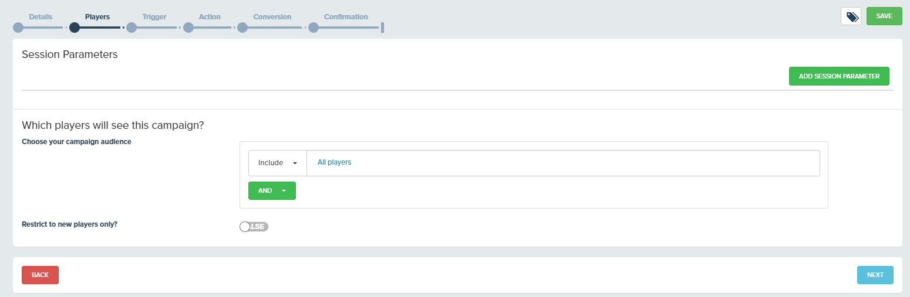

Trigger where in the game this campaign will activate, **missionCompleted** event, **missionID** equal to 1

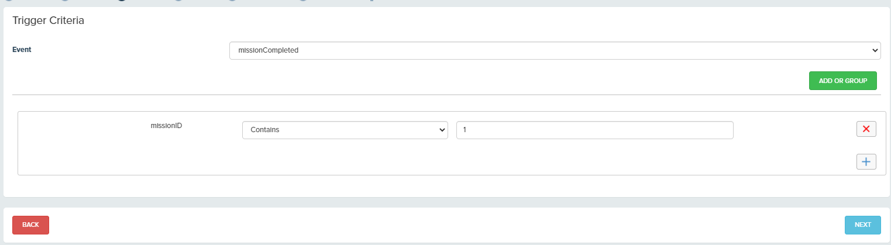

We will send the game parameter action for the notifcations

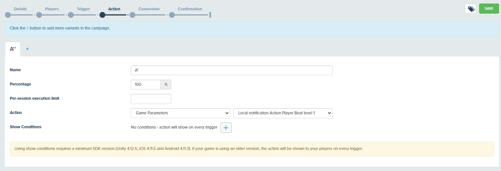

### Campaign setup for Scenario #2 - Power Levels recharged 1 minute after leaving game

A local notification will be scheduled for delivery 1 minute after the player exits or backgrounds the game, based on the **gamePaused** custom event.

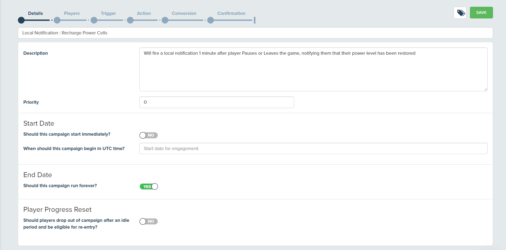

Target Segment/Audience in this scenario we are targeting **All players**

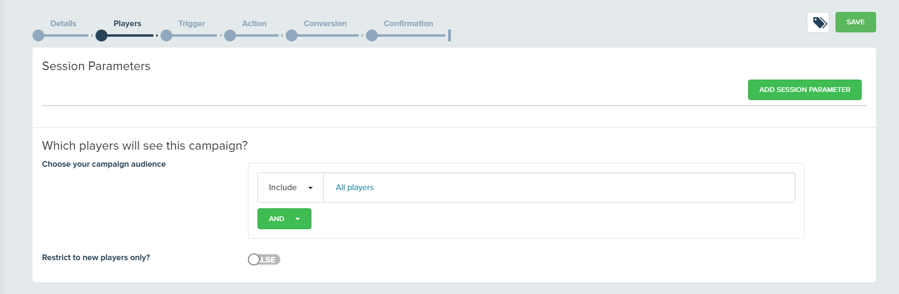

Trigger where in the game this campaign will activate, **gamePaused** event

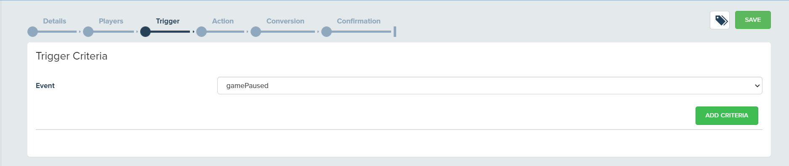

We will send the **Local Notification, Power Restored** Game Parameters action for the notifcation

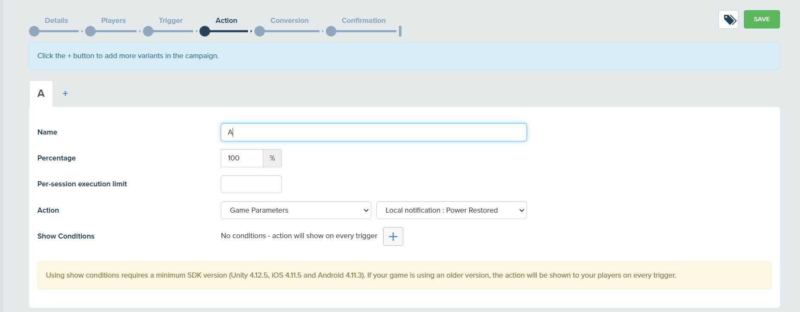

### Cancelling Notifications

Two additinal Event Triggered Campaigns and corresponding Game Parameter Actions have been created to **Cancel** each scheduled notification if the player records a specific event that indicates that the notification is no longer relevant. 

In each case the Game Parameter action contains 2 game Parameters that are used by the game client to delete the specific notification.

- **notificationId** corresponds to the unique notificationId specified in the scheduled notification and ensures that the correct notfication is cancelled.
- **localNotifTitle** contains the value **CANCEL**, this value is used to instruct the game client to cancel the specified notification.

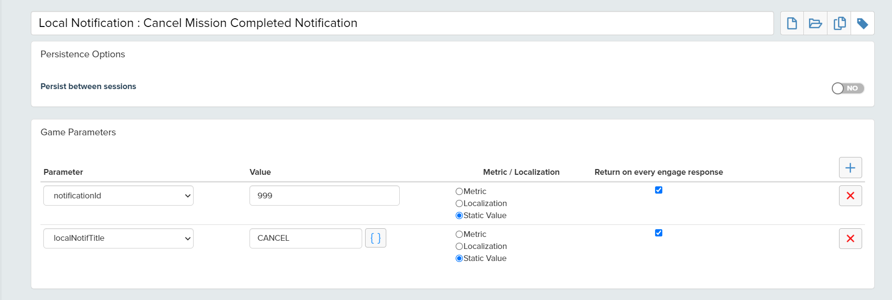

### Scenario #1 - Mission 1 Completed

Is cancelled if the player records a **missionCompleted** event with **missionID** equal to 2

### Scenario #2 - Power Levels Recharged

Is cancelled if the player records a **gameResumed** event.

## Code

These are the main snippets of code for a full comprehensive on mobile notifcations feel free to check out the code in github

Game handler to handle the campaign send

```csharp
 private void myGameParameterHandler(Dictionary<string, object> gameParameters)
    {
        // Generic Game Parameter Handler
        Debug.Log("Received game parameters from Engage campaign: " + DeltaDNA.MiniJSON.Json.Serialize(gameParameters));

        // Catch Game parameters that control local notifications 
        if (gameParameters.ContainsKey("localNotifTitle"))
        {
            if(gameParameters["localNotifTitle"].ToString().Contains("CANCEL"))
            {
                oMobileNotif.CancelScheduledNotification(Convert.ToInt32(gameParameters["notificationId"]));
            }
            else
            {
                oMobileNotif.SendDDNANotification(gameParameters);
            }
        }
    }
```

The following code snippet is used to schedule the local notification and send a local notification reporting event.

```csharp
    public void SendDDNANotification(Dictionary<string, object> gameParameters)
    {

        //Prepare the unity mobile notificaitons
        notificationID = Convert.ToInt32(gameParameters["notificationId"]); //SET notification Id else comment this line to let the packagage generate one
#if UNITY_ANDROID
        var notification = new AndroidNotification();
        notification.IntentData = "{\"campaignId\": \"id 1\", \"campaignName\": \"name\",\"notificationId\": \"id 1\",}";
        notification.SmallIcon = "my_custom_icon_id";
        notification.LargeIcon = "my_custom_large_icon_id";
        notification.Title = gameParameters["localNotifTitle"].ToString();
        notification.Text = gameParameters["localNotifDesc"].ToString();
        notification.FireTime = System.DateTime.Now.AddMinutes(Convert.ToDouble(gameParameters["localNotifTime"]));
       
        //Send the notification with unity mobile notifications
        AndroidNotificationCenter.SendNotificationWithExplicitID(notification, "channel_id", notificationID);
#elif UNITY_IOS
        var notification = new iOSNotification();
        System.DateTime date = System.DateTime.Now.AddMinutes(Convert.ToDouble(gameParameters["localNotifTime"]));

        notification.Identifier = notificationID.ToString();
        notification.Title = gameParameters["localNotifTitle"].ToString();
        notification.Body = gameParameters["localNotifDesc"].ToString();
        notification.Trigger = notification.Trigger = new iOSNotificationCalendarTrigger
        {
            Year = date.Year,
            Month = date.Month,
            Day = date.Day,
            Hour = date.Hour,
            Minute = date.Minute,
            Second = date.Second
        };
        
        //Send the notification with unity mobile notifications
        iOSNotificationCenter.ScheduleNotification(notification);
        Debug.Log("Sceduled Notification");               

#endif

        //Record the event for reporting services
        GameEvent localNotifications = new GameEvent("localNotifications");
        localNotifications.AddParam("notificationId", Convert.ToInt32(gameParameters["notificationId"]));
        localNotifications.AddParam("campaignId", Convert.ToInt32(gameParameters["campaignId"]));
        localNotifications.AddParam("campaignName", gameParameters["campaignName"].ToString());
        localNotifications.AddParam("cohortId", Convert.ToInt32(gameParameters["cohortId"]));
        localNotifications.AddParam("cohortName", gameParameters["cohortName"].ToString());
        localNotifications.AddParam("communicationSender", "Unity Mobile Notifications");
        localNotifications.AddParam("communicationState", "SENT");
        localNotifications.AddParam("localNotifTitle", notification.Title);

#if UNITY_IOS
        localNotifications.AddParam("localNotifDesc", notification.Body); 
#elif UNITY_ANDROID
         localNotifications.AddParam("localNotifDesc", notification.Text); 
#endif
        localNotifications.AddParam("localNotifTime", Convert.ToInt32(gameParameters["localNotifTime"])); 

        // Record the missionStarted event event with some event parameters. 
        DDNA.Instance.RecordEvent(localNotifications).Run();

    }
```

The following code is used to cancel a previously scheduled local notification

```csharp
    public void CancelScheduledNotification(int notifId)
    {
#if UNITY_ANDROID
        var notificationStatus = AndroidNotificationCenter.CheckScheduledNotificationStatus(notifId);

        if (notificationStatus == NotificationStatus.Scheduled)
        {
            // Cancel the scheduled notification.
            AndroidNotificationCenter.CancelNotification(notifId);

            txtStatus.text = "Android Notification Cancelled " + notifId.ToString(); 
        }
#elif UNITY_IOS
        var scheduledNotifications = iOSNotificationCenter.GetScheduledNotifications();

        foreach (iOSNotification n in scheduledNotifications)
        {
            if (n.Identifier == notifId.ToString())
            {
                iOSNotificationCenter.RemoveScheduledNotification(notifId.ToString());
                txtStatus.text = "IOS Notification Cancelled " + notifId.ToString();
            }
        }        
#endif
    }
```